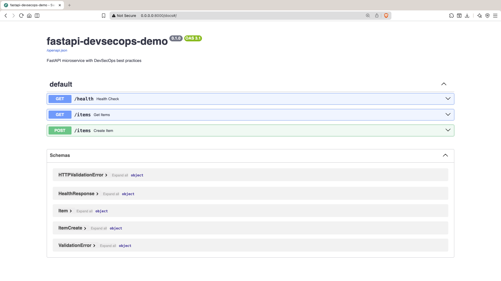
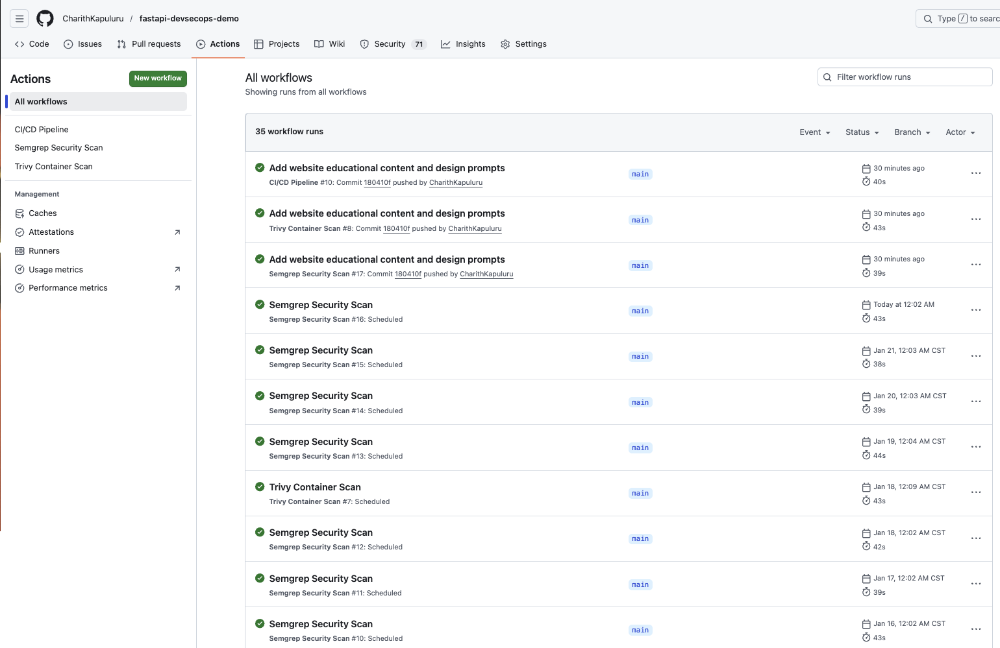
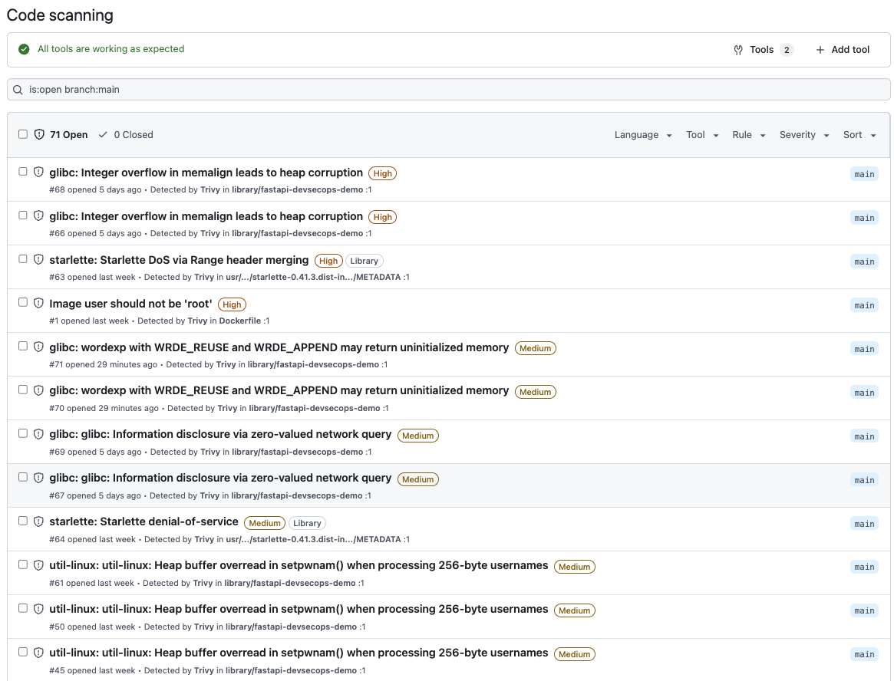

# FastAPI DevSecOps Demo

[](https://github.com/CharithKapuluru/fastapi-devsecops-demo/actions/workflows/ci.yml)
[](https://github.com/CharithKapuluru/fastapi-devsecops-demo/actions/workflows/semgrep.yml)
[](https://github.com/CharithKapuluru/fastapi-devsecops-demo/actions/workflows/trivy.yml)
[](https://opensource.org/licenses/MIT)

A FastAPI microservice demonstrating DevSecOps practices including automated security scanning, CI/CD pipelines, and containerization. Designed for Cloud Engineer, DevOps Engineer, and DevSecOps Engineer positions.

## Overview

This project implements a REST API with automated testing, code quality checks, Docker containerization, and integrated security scanning. The CI/CD pipeline automatically runs tests, builds containers, and performs security analysis on every commit.

**Key Features:**
- RESTful API with FastAPI and automatic OpenAPI documentation
- Test coverage with pytest (18 tests)
- Code quality enforcement with Ruff
- Docker containerization with optimized builds
- GitHub Actions CI/CD automation
- SAST security scanning with Semgrep
- Container vulnerability scanning with Trivy
- Structured JSON logging
- Built-in health checks

## Architecture

```
┌─────────────────────────────────────────────────────────────┐
│                         GitHub                              │
│  ┌───────────┐  ┌──────────┐  ┌────────────────────────┐  │
│  │  Push     │→ │ Actions  │→ │ Workflows              │  │
│  │  Code     │  │ Trigger  │  │ ├─ Lint & Test         │  │
│  └───────────┘  └──────────┘  │ ├─ Build & Push Docker │  │
│                                │ ├─ Semgrep SAST        │  │
│                                │ └─ Trivy Container Scan│  │
│                                └────────────────────────┘  │
└─────────────────────────────────────────────────────────────┘
                            ↓
┌─────────────────────────────────────────────────────────────┐
│             GitHub Container Registry (ghcr.io)             │
│  fastapi-devsecops-demo:latest                              │
└─────────────────────────────────────────────────────────────┘
                            ↓
┌─────────────────────────────────────────────────────────────┐
│                   Deployment Target                         │
│  AWS ECS | Google Cloud Run | Azure Container Instances    │
│  Kubernetes | Docker Swarm                                  │
└─────────────────────────────────────────────────────────────┘
```

## Screenshots

### Swagger UI Documentation


### CI/CD Pipeline (All Checks Passing)


### Security Scan Results


## Demo Video

Watch a 60-second walkthrough of the project:

[](YOUR_VIDEO_LINK_HERE)

*Covers: API endpoints, Swagger UI, CI/CD pipeline, and security scanning*

## Quick Start

### Prerequisites

- Python 3.12+
- Docker (optional)
- Git

### Local Development

```bash
# Clone repository
git clone https://github.com/CharithKapuluru/fastapi-devsecops-demo.git
cd fastapi-devsecops-demo

# Create virtual environment
python -m venv venv
source venv/bin/activate  # Windows: venv\Scripts\activate

# Install dependencies
pip install -r requirements.txt

# Run application
uvicorn app.main:app --reload --host 0.0.0.0 --port 8000

# Access API
# - API: http://localhost:8000
# - Swagger UI: http://localhost:8000/docs
# - ReDoc: http://localhost:8000/redoc
```

### Docker Deployment

```bash
# Build image
docker build -t fastapi-devsecops-demo:latest .

# Run container
docker run -d -p 8000:8000 --name fastapi-app fastapi-devsecops-demo:latest

# Or use published image
docker pull ghcr.io/charithkapuluru/fastapi-devsecops-demo:latest
docker run -d -p 8000:8000 ghcr.io/charithkapuluru/fastapi-devsecops-demo:latest
```

### Makefile Commands

```bash
make help          # Show available commands
make run           # Run locally
make test          # Run tests
make lint          # Run linting
make format        # Format code
make docker-build  # Build Docker image
make docker-run    # Run Docker container
make docker-stop   # Stop container
```

## API Endpoints

### Health Check
```bash
GET /health
```
Returns service health status for load balancers and orchestration platforms.

**Response:**
```json
{
  "status": "ok"
}
```

### Get All Items
```bash
GET /items
```
Retrieves all items from in-memory storage.

**Response:**
```json
[
  {
    "id": 1,
    "name": "Laptop",
    "description": "MacBook Pro 16-inch"
  }
]
```

### Create Item
```bash
POST /items
Content-Type: application/json

{
  "name": "Laptop",
  "description": "MacBook Pro 16-inch"
}
```

**Validation:**
- `name`: Required, 1-100 characters
- `description`: Optional, max 500 characters

**Response:**
```json
{
  "id": 1,
  "name": "Laptop",
  "description": "MacBook Pro 16-inch"
}
```

## Tech Stack

**Core:**
- Python 3.12
- FastAPI 0.115+
- Pydantic 2.10+
- Uvicorn 0.34+

**Development:**
- Pytest 8.3+
- Ruff 0.9+
- Docker
- Make

**CI/CD & Security:**
- GitHub Actions
- Semgrep (SAST)
- Trivy (Container scanning)
- GitHub Container Registry

## Skills Demonstrated

| Category | Skills |
|----------|--------|
| **CI/CD** | GitHub Actions, Automated Pipelines, Container Registry |
| **Security** | SAST (Semgrep), Container Scanning (Trivy), SARIF Reports |
| **Containerization** | Docker, Multi-stage Builds, Image Optimization |
| **API Development** | FastAPI, REST APIs, OpenAPI/Swagger, Pydantic Validation |
| **Testing** | Pytest, Test Coverage, API Testing |
| **Code Quality** | Ruff Linting, Code Formatting, Type Hints |
| **Documentation** | README, API Docs, Inline Comments |

## Testing

The project includes 18 tests covering health checks, CRUD operations, input validation, edge cases, and API response formats.

```bash
# Run all tests
pytest tests/ -v

# Run with coverage
pytest tests/ -v --cov=app --cov-report=html

# Run specific test class
pytest tests/test_api.py::TestHealthEndpoint -v
```

**Test Results:**
```
18 passed in 0.33s
```

## Security

### Semgrep SAST Scanning
Automated static analysis detecting:
- SQL injection patterns
- Cross-Site Scripting (XSS)
- Hardcoded secrets
- Insecure cryptography
- Command injection
- OWASP Top 10 vulnerabilities

Configuration: `.github/workflows/semgrep.yml`

### Trivy Container Scanning
Container security analysis for:
- OS package vulnerabilities (Debian)
- Python dependency vulnerabilities
- Dockerfile misconfiguration
- Hardcoded secrets in image layers

Configuration: `.github/workflows/trivy.yml`

### Code Quality
- Ruff linting with 700+ rule checks
- Automated formatting validation
- Type checking with Pydantic
- Input validation on all endpoints

View security results in the **Security** tab on GitHub.

## CI/CD Pipeline

### CI/CD Workflow (ci.yml)
**Triggers:** Push to main, Pull Requests

**Jobs:**
1. Lint and Test
   - Ruff linting checks
   - Ruff formatting validation
   - Pytest test suite

2. Build and Push Docker (main branch only)
   - Build with BuildKit
   - Push to GitHub Container Registry
   - Tag: latest, main, main-sha

### Security Workflows

**Semgrep (semgrep.yml)**
- Runs: Push, PR, Daily at 6 AM UTC
- Scans: Python code
- Output: GitHub Security tab (SARIF)

**Trivy (trivy.yml)**
- Runs: Push, PR, Weekly on Sundays
- Scans: Docker image and Dockerfile
- Output: GitHub Security tab (SARIF)

## Project Structure

```
fastapi-devsecops-demo/
├── app/
│   ├── __init__.py
│   ├── config.py
│   ├── main.py
│   └── models.py
├── tests/
│   ├── __init__.py
│   └── test_api.py
├── .github/
│   └── workflows/
│       ├── ci.yml
│       ├── semgrep.yml
│       └── trivy.yml
├── Dockerfile
├── .dockerignore
├── .gitignore
├── .semgrepignore
├── .trivyignore
├── Makefile
├── pyproject.toml
├── requirements.txt
├── LICENSE
└── README.md
```

## Docker

**Image Specifications:**
- Base: python:3.12-slim
- Size: ~190MB
- Port: 8000
- Health Check: 30s interval

**Features:**
- Layer caching for fast rebuilds
- Non-buffered output for real-time logs
- No bytecode files for smaller size
- Automated health checks

**Environment:**
- `PYTHONDONTWRITEBYTECODE=1`
- `PYTHONUNBUFFERED=1`

## Logging

Structured JSON logging for observability:

```json
{
  "timestamp": "2026-01-12 19:10:34,300",
  "level": "INFO",
  "message": "Created item with ID 1: Test Item",
  "module": "app.config"
}
```

Easy integration with CloudWatch, Datadog, Splunk, and other log aggregators.

## Future Enhancements

- PostgreSQL database integration
- JWT authentication
- Rate limiting middleware
- Extended test coverage
- Integration tests
- Cloud deployment (AWS/GCP/Azure)
- Prometheus metrics
- Redis caching
- OpenTelemetry tracing
- Kubernetes manifests

## Development Workflow

1. Create feature branch
   ```bash
   git checkout -b feature/new-feature
   ```

2. Make changes and test
   ```bash
   make lint
   make test
   make format
   ```

3. Commit and push
   ```bash
   git add .
   git commit -m "feat: add new feature"
   git push origin feature/new-feature
   ```

4. Create Pull Request
   - Automated checks run
   - Review results
   - Merge when passing

5. Automatic deployment to container registry

## Contributing

This is a portfolio project. For suggestions:

1. Fork the repository
2. Create a feature branch
3. Make changes
4. Submit a pull request

## License

MIT License - see LICENSE file for details.

## Author

**Charith Kapuluru**
- GitHub: [@CharithKapuluru](https://github.com/CharithKapuluru)
- LinkedIn: [linkedin.com/in/charith-kapuluru-159456329](https://www.linkedin.com/in/charith-kapuluru-159456329/)

## Acknowledgments

- FastAPI documentation and community
- GitHub Actions
- Semgrep and Trivy
- Open-source community
